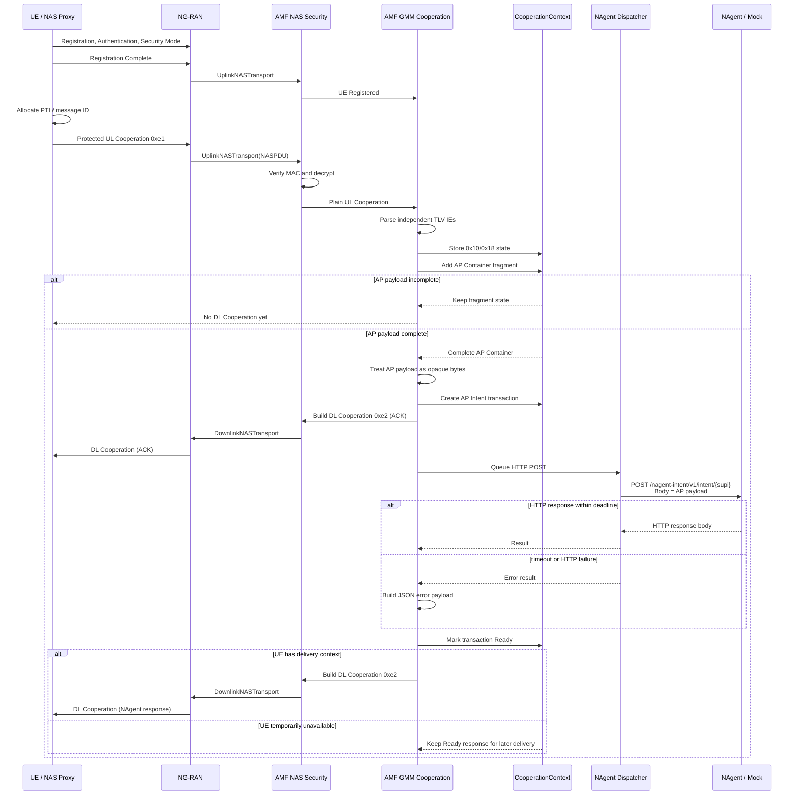
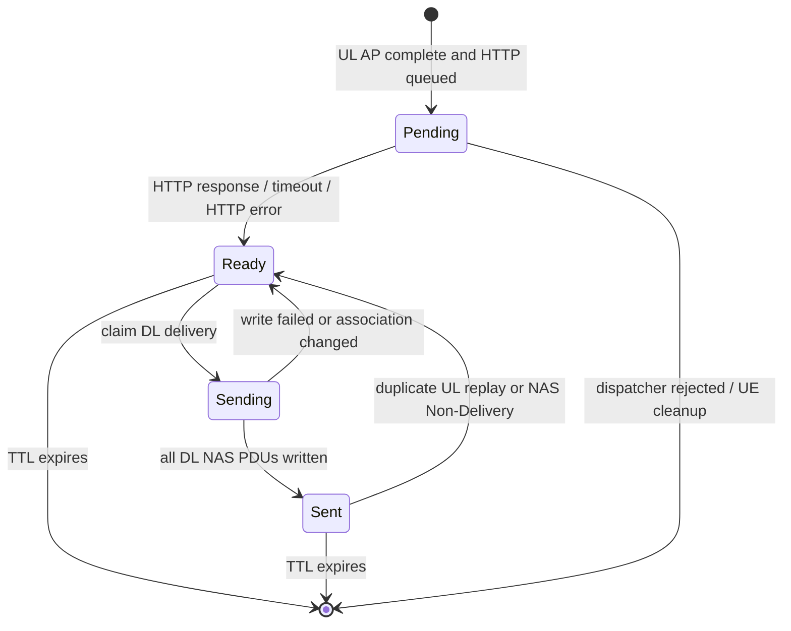

# AMF AP Intent and NAgent Flow

本文档描述当前 AMF 分支新增的 UL/DL Cooperation、AP Container、NAgent HTTP 转发以及 DL 回包流程。该能力是本地 NAS/GMM 扩展，不属于原版 free5GC 或 3GPP 标准消息。

## 1. 功能概览

新增流程由 UE 或 NAS 代理主动发起。UE 完成注册并建立 NAS security context 后，发送一条受保护的 UL Cooperation NAS message。AMF 解密后解析其中的独立 TLV IE，并在 AP Container IE `0x71` 重组完成后，把 AP payload 作为不透明 HTTP body 转发到 NAgent。

创建事务后，AMF 会先下发一条 ACK DL Cooperation，告知 UE 请求已被接受。NAgent 返回 HTTP 响应后，AMF 将 HTTP response body 封装进最终 DL AP Container，通过 DL Cooperation NAS message 下发给 UE。AMF 不会在 HTTP 响应前提前下发最终 NAgent 响应；当前总等待截止时间默认为 3 秒。收到 HTTP 响应或等待超时后，AMF 才生成最终 DL Cooperation。

核心消息和 IE：

```text
UL Cooperation NAS message type = 0xe1
DL Cooperation NAS message type = 0xe2
AP Container IEI                = 0x71
Intent ContainerType            = 0x0101
```

AP payload 对 AMF 是不透明字节序列，可以是 JSON、文本、二进制或未来自定义格式。AMF 不校验 payload 内部结构，也不补充或改写字段。

## 2. 总体流程



## 3. Cooperation NAS 外层格式

UL 和 DL Cooperation 的 plain NAS body 使用相同外层布局：

```text
Offset  Length  Field
0       1       EPD, 0x7e
1       1       SecurityHeaderType in plain body, 0x00
2       1       MessageType, UL=0xe1, DL=0xe2
3       1       MessageIdentity
4       ...     Optional IE TLV list
```

IE 是相互独立的 TLV。当前实现允许同一条消息同时出现普通 IE 和 AP Container IE，但同一条消息最多一个 `0x71`。

外层 IE length 编码由 `MessageIdentity` 决定：

```text
MessageIdentity == 0x01:
  IEI(1) + Length(1, uint8) + Value(Length)

MessageIdentity != 0x01:
  IEI(1) + Length(2, uint16, big-endian) + Value(Length)
```

这只是 Cooperation IE 外层 length 的差异。AP Container IE `0x71` 内部格式始终使用本文第 5 节的新格式，不兼容旧的 4-byte `ContainerContent`。

## 4. 当前 IE 行为

UL 支持的 IE：

```text
IEI   行为
0x10  存入 NegotiatedIEs，并在 DL 中返回同 IEI 和内容
0x18  存入 NegotiatedIEs，不生成 DL 0x18
0x71  作为 AP Container 解析、重组、触发 NAgent Intent 流程
```

DL 当前只生成：

```text
IEI   行为
0x10  普通能力/协商响应 IE
0x71  DL AP Container，承载 NAgent 响应或错误 JSON
```

普通 IE 与 AP Container 独立解析，但在启用 NAgent 后，普通 IE 的 DL 响应会和 AP Intent 事务一起等待 HTTP 完成。这样可以保证同一条 UL 中的普通响应和 AP 响应在同一轮 DL Cooperation 流程里下发。

如果 UL 中没有 `0x71`，或者 AP Container 无效且被丢弃，普通 `0x10` 仍可立即生成 DL 响应。

## 5. AP Container 格式

AP Container 是 IE `0x71` 的 Value。当前内部头固定 10 字节：

```text
Offset  Length  Field
0       2       ContainerType, uint16
2       2       ContainerContentLength, uint16
4       1       ContainerTypePTI, uint8
5       2       ContainerPayloadId, uint16
7       1       ContainerFlags, uint8
8       2       FragmentOffset, uint16
10      N       Payload
```

所有多字节字段均为 big-endian。

长度关系：

```text
ContainerContentLength = 6 + len(Payload)
APContainerValueLength = 10 + len(Payload)
OuterIELength          = APContainerValueLength
```

字段含义：

```text
ContainerType
  2 字节应用容器类型。当前 Intent 流程使用 0x0101。

ContainerContentLength
  从 PTI 开始到 Payload 结束的长度，等于 6 + Payload 长度。

ContainerTypePTI
  1 字节消息 ID / procedure transaction identity。
  当前由 UE 或 NAS 代理生成，AMF 不为 UL 生成 PTI。
  AMF 在 DL 中复用原 UL PTI。

ContainerPayloadId
  2 字节载荷 ID，用于分片重组和事务关联。

ContainerFlags
  AP Container 标志位。

FragmentOffset
  当前分片 Payload 在完整 Payload 中的字节偏移。

Payload
  应用层载荷。ContainerType=0x0101 时，AMF 将其作为不透明字节透传给 NAgent。
```

Flags：

```text
Bit   Mask  Name  Meaning
1     0x02  DF    0=允许分片, 1=禁止分片
2     0x04  MF    0=最后一个分片, 1=后面还有分片
```

reserved bits 必须为 0，否则 AMF 拒绝该 AP Container。

约束：

```text
DF=1 -> MF 必须为 0，FragmentOffset 必须为 0
MF=1 -> 表示后续还有分片
空 Payload -> MF 必须为 0，FragmentOffset 必须为 0
FragmentOffset 单位是字节
FragmentOffset + len(Payload) <= 65535
完整重组 Payload <= 65535 字节
```

## 6. PTI 和并发事务

PTI 当前作为 UE/NAS 代理生成的 1 字节消息 ID。它用于让 UE 在收到 DL AP Container 时识别响应对应哪次 UL 请求。

当前职责划分：

```text
UE / NAS Proxy:
  生成 PTI
  写入 UL AP Container 的 ContainerTypePTI
  避免同一 UE 内还未完成的请求复用 PTI

AMF:
  读取 UL PTI
  将 PTI 存入 AP Intent transaction
  HTTP callback 完成后从 transaction 恢复 PTI
  写入 DL AP Container 的 ContainerTypePTI

NAgent:
  不需要解析 PTI
  PTI 通过 HTTP header 传递，仅用于调试或响应关联校验
```

PTI 不是 AMF 的唯一事务键。AMF 内部事务以 `ContainerPayloadId` 为主要索引，并结合 request fingerprint、generation、HTTPRequestID 校验并发和重放。Fingerprint 覆盖：

```text
SUPI
AccessType
MessageIdentity
ContainerType
PTI
PayloadId
Payload bytes
```

推荐 NAS 代理 PTI 分配规则：

```text
可用范围: 0x01..0xff
避免使用: 0x00
释放条件: 收到 DL 响应、收到错误响应、或本地等待超时
复用策略: 循环递增，跳过仍在等待的 PTI
```

## 7. UL AP Payload 透传

当 `ContainerType=0x0101` 时，UL AP Container payload 被 AMF 视为不透明字节序列。AMF 不解析 payload 的 JSON 结构，不校验内部字段，也不补充或改写字段。

当前 AMF 只负责：

```text
校验 AP Container 外层编码和分片字段
重组完整 AP payload
保存 PTI / PayloadId / MessageIdentity / AccessType 等关联元数据
将完整 AP payload 原样作为 HTTP body 转发给 NAgent
将 NAgent 响应 body 原样放入 DL AP Container
```

因此 UE 可以发送 JSON、文本、二进制或未来自定义格式。格式语义由 UE/NAS 代理和 NAgent 自行约定，AMF 不参与解释。

## 8. HTTP 请求格式

AMF 对 NAgent 使用 HTTP POST：

```text
POST /nagent-intent/v1/intent/{supi}
Content-Type: application/octet-stream
Accept: application/octet-stream, application/json, */*
Idempotency-Key: <request fingerprint hex>
X-NAgent-Request-ID: <same as Idempotency-Key>
X-AP-Access-Type: <3GPP_ACCESS or NON_3GPP_ACCESS>
X-AP-Message-Identity: <decimal>
X-AP-Container-Type: <decimal>
X-AP-PTI: <decimal>
X-AP-Payload-ID: <decimal>

<exact reassembled UL AP Container payload bytes>
```

示例（UL AP Container Payload 是 JSON 时也只做原样透传）：

```http
POST /nagent-intent/v1/intent/imsi-001010000000001 HTTP/1.1
Content-Type: application/octet-stream
Accept: application/octet-stream, application/json, */*
Idempotency-Key: 6b3f...
X-NAgent-Request-ID: 6b3f...
X-AP-Access-Type: 3GPP_ACCESS
X-AP-Message-Identity: 1
X-AP-Container-Type: 257
X-AP-PTI: 42
X-AP-Payload-ID: 4660

{"intent":"Locate the target UE"}
```

注意：

```text
0x0101 的十进制 HTTP header 表示是 257
0x1234 的十进制 HTTP header 表示是 4660
HTTP body 与重组后的 UL AP Container payload 完全一致
AMF 不保证 HTTP body 是 JSON，也不校验其中字段
```

## 9. HTTP 响应处理

NAgent 成功响应要求：

```text
HTTP status: 200
Body size <= maxPayloadBytes
```

HTTP response body 被视为不透明字节序列。AMF 不从 response body 解析 PTI，也不要求 body 内携带 PTI。AMF 通过本地 transaction 和 HTTP request ID 恢复原 UL PTI。

如果响应携带下列 header，AMF 会校验它们和原请求一致：

```text
X-NAgent-Request-ID
X-AP-Access-Type
X-AP-Message-Identity
X-AP-Container-Type
X-AP-PTI
X-AP-Payload-ID
```

响应 header 缺失是允许的；但只要出现且不匹配，就会被视为 `NAGENT_INVALID_RESPONSE`。

内置 mock 的行为：

```text
接收 POST /nagent-intent/v1/intent/{supi}
原样返回 request body
回显上述 X-* 关联 header
```

## 10. ACK 确认消息

AMF 在转发给 NAgent 之前，会先向 UE 下发一条 ACK DL Cooperation 消息，告知 UE 请求已被接受并正在处理。

ACK 发送时机：AP Intent 事务创建成功（`BeginAPIntentWithLimit` 返回 `BeginNew`）且 Dispatcher 可用后、`Dispatcher.Submit` 之前。

ACK 消息格式：

```text
DL Cooperation NAS message type = 0xe2
DL AP Container:
  ContainerType      = 0x0101
  ContainerTypePTI   = 原 UL PTI
  ContainerPayloadId = 原 UL PayloadId
  ContainerFlags     = 0x02 (DF=1, MF=0)
  FragmentOffset     = 0
  Payload            = ACK JSON
```

ACK JSON payload：

```json
{"$nagent":{"version":1,"status":"accepted"}}
```

UE 可通过以下字段区分 ACK 和最终 NAgent 响应：

```text
ACK:
  Payload JSON 中 status = "accepted"
  Payload JSON 中不含 code/retryable/httpStatus/message 等错误字段

最终响应:
  Payload 为 NAgent HTTP response body（原样透传）
  或错误 payload（status = "error"，含 code/message 等字段）
```

完整时序：

```text
UE --UL Cooperation(AP Container)--> AMF
                                     AMF: 分片重组 → opaque payload 透传准备 → 创建事务
  UE <--DL Cooperation(ACK)--> AMF       Payload: {"$nagent":{"version":1,"status":"accepted"}}
                                     AMF: → HTTP POST NAgent
                                     ... NAgent 处理（mock 默认延迟 8 秒）...
                                     NAgent --HTTP 响应--> AMF
  UE <--DL Cooperation(NAgent响应)--> AMF
```

ACK 发送失败（如 RanUe 不可用）不会阻塞 NAgent 转发流程，AMF 会记录警告日志后继续提交 HTTP 请求。

## 11. 超时和错误响应

默认 NAgent 总等待时间：

```yaml
totalTimeoutMs: 3000
```

AMF 会在 HTTP 完成前下发 ACK DL AP Container，但不会提前下发最终 NAgent 响应。达到 3 秒截止时间后，AMF 生成错误 JSON payload 作为最终 DL AP Container 下发。

错误 payload 格式：

```json
{
  "$nagent": {
    "version": 1,
    "status": "error",
    "code": "NAGENT_TIMEOUT",
    "retryable": true,
    "httpStatus": 0,
    "message": "NAgent did not respond before the deadline"
  }
}
```

常见错误码：

```text
NAGENT_INVALID_JSON       保留错误码；当前透传流程不会因 UL payload 非 JSON 触发
NAGENT_INVALID_REQUEST    请求元数据或 HTTP 请求构造失败
NAGENT_PAYLOAD_TOO_LARGE  请求或响应超过配置上限
NAGENT_TIMEOUT            HTTP 总等待超时
NAGENT_REJECTED           NAgent 返回非 200 且不属于可重试状态
NAGENT_INVALID_RESPONSE   NAgent 响应关联 header 不匹配
NAGENT_RESPONSE_TOO_LARGE NAgent 响应过大
NAGENT_UNAVAILABLE        HTTP client、dispatcher 或 mock 不可用
PAYLOAD_ID_CONFLICT       同一 PayloadId 存在不同请求内容
AMF_QUEUE_FULL            NAgent dispatcher 或 UE in-flight 达到上限
```

错误 payload 同样使用 DL AP Container 下发：

```text
DL ContainerType = 0x0101
DL PTI           = 原 UL PTI
DL PayloadId     = 原 UL PayloadId
DL Payload       = 错误 JSON
```

## 12. DL AP Container 生成

NAgent 成功或失败后，AMF 都会生成 DL AP Container。当前 DL ContainerType 固定为：

```text
ContainerType = 0x0101
```

DL AP Container 继承：

```text
ContainerTypePTI   = 原 UL AP Container 的 PTI
ContainerPayloadId = 原 UL AP Container 的 PayloadId
Payload            = HTTP response body 或错误 JSON body
```

DL 分片规则：

```text
MessageIdentity == 0x01:
  每条 0x71 Value 最大 255 字节
  AP header 10 字节
  单片 Payload 最大 245 字节

MessageIdentity != 0x01:
  外层 IE length 使用 2 字节
  单条 AP Value 最大 65535 字节
```

AMF 对完整 HTTP response body 重新分片，不复用 UL 分片边界。

DL 第一条消息可以同时携带普通 IE 和 AP Container IE：

```text
DL #1:
  7e 00 e2 01
  10 01 01
  71 <len> <AP fragment 0>

DL #2:
  7e 00 e2 01
  71 <len> <AP fragment 1>
```

每条 DL Cooperation 最多一个 `0x71`。

## 13. NAS 和 NGAP 投递行为

DL Cooperation 会被封装为 DownlinkNASTransport，经 NAS security 保护后通过 NGAP 下发。

当前新增的可靠性行为：

```text
HTTP response Ready 后，如果 UE 有可用 RAN UE，立即下发。
如果 UE 暂时不可达，AP Intent transaction 保持 Ready，等待后续注册态或 Service Request 后重试。
如果发生 handover 或 path switch，AMF 会尝试切到当前 RAN UE 下发。
如果 NGAP NAS Non-Delivery 指示命中已发送的 AP Intent DL NAS PDU，事务回到 Ready 等待重试。
如果 SCTP 写失败，事务保持 Ready。
如果 SCTP 写成功，事务进入 Sent。
Sent 只表示 AMF 已写入 RAN 连接，不表示 UE 已确认收到。
```

状态机：



## 14. 配置

默认配置位置：

```yaml
configuration:
  nagent:
    enabled: true
    baseUri: http://127.0.0.1:8088
    connectTimeoutMs: 1000
    attemptTimeoutMs: 10000
    totalTimeoutMs: 12000
    maxAttempts: 1
    maxPayloadBytes: 65535
    maxInFlight: 64
    maxInFlightPerUe: 8
    queueSize: 256
    pendingDlTtlSeconds: 60
    mock:
      enabled: true
      listenAddress: 127.0.0.1:8088
      delayMs: 8000
      status: 200
```

关键配置含义：

```text
enabled
  是否启用 AP Intent -> NAgent HTTP -> DL AP Container 流程。

baseUri
  NAgent 服务地址。第一版只支持 http，不支持 https。

attemptTimeoutMs
  单次 HTTP 请求超时。需大于 mock.delayMs。
  当前默认 10000ms（10 秒），配合 8 秒延迟使用。

totalTimeoutMs
  从提交 HTTP job 到得到最终结果的总截止时间。需大于 mock.delayMs。
  当前默认 12000ms（12 秒），配合 8 秒延迟使用。

maxAttempts
  HTTP 重试次数。当前设为 1（不重试），因为每次请求含 8 秒延迟。

maxInFlight
  全局并发 HTTP job 上限。

maxInFlightPerUe
  单 UE AP Intent 并发事务上限。

queueSize
  NAgent dispatcher 等待队列大小。

pendingDlTtlSeconds
  HTTP response Ready 后等待 DL 投递的 TTL。

mock.enabled
  启动 AMF 时内嵌一个 mock NAgent。

mock.delayMs
  Mock NAgent 响应延迟毫秒数。当前设为 8000（8 秒）。
  需确保 attemptTimeoutMs 和 totalTimeoutMs 大于此值。
```

## 15. 完整消息示例

### 15.1 UL Cooperation plain NAS

假设：

```text
MessageIdentity  = 0x01
普通 IE 0x10     = 01
ContainerType    = 0x0101
PTI              = 0x2a
PayloadId        = 0x1234
Flags            = 0x02, DF=1, MF=0
FragmentOffset   = 0
Payload          = 透传 AP payload
```

示例 AP Payload：

```text
{"intent":"Locate the target UE"}
```

AP Container Value：

```text
01 01        ContainerType = 0x0101
00 27        ContainerContentLength = 39 = 6 + 33
2a           PTI
12 34        PayloadId
02           Flags = DF
00 00        FragmentOffset
7b ... 7d    Payload bytes, 33 bytes
```

UL Cooperation plain NAS：

```text
7e 00 e1 01
10 01 01
71 2b
01 01 00 27 2a 12 34 02 00 00
7b 22 69 6e 74 65 6e 74 22 3a 22 4c 6f 63 61 74
65 20 74 68 65 20 74 61 72 67 65 74 20 55 45 22
7d
```

说明：

```text
7e 00 e1 01     UL Cooperation header
10 01 01        ordinary IE 0x10
71 2b           AP Container IEI + outer length, 43 bytes
01 01 ...       AP Container value
```

实际空口/NGAP 中该 plain NAS 会被 NAS security 包成 protected NAS。

### 15.2 NAgent HTTP request

AMF 转发的 HTTP body 与上面的 AP payload 完全一致：

```http
POST /nagent-intent/v1/intent/imsi-001010000000001 HTTP/1.1
Content-Type: application/octet-stream
Accept: application/octet-stream, application/json, */*
Idempotency-Key: <sha256 fingerprint>
X-NAgent-Request-ID: <sha256 fingerprint>
X-AP-Access-Type: 3GPP_ACCESS
X-AP-Message-Identity: 1
X-AP-Container-Type: 257
X-AP-PTI: 42
X-AP-Payload-ID: 4660

{"intent":"Locate the target UE"}
```

### 15.3 NAgent HTTP response

mock NAgent 示例响应：

```http
HTTP/1.1 200 OK
Content-Type: application/octet-stream
X-NAgent-Request-ID: <same as request>
X-AP-Access-Type: 3GPP_ACCESS
X-AP-Message-Identity: 1
X-AP-Container-Type: 257
X-AP-PTI: 42
X-AP-Payload-ID: 4660

{"intent":"Locate the target UE"}
```

真实 NAgent 可以返回 JSON、文本或二进制结果。AMF 会把 response body 原样放进 DL AP Container。

### 15.4 DL Cooperation ACK（新增）

AMF 在收到 UL Cooperation 后、转发 NAgent 前发送的 ACK 消息。

假设 UL 参数：

```text
MessageIdentity  = 0x01
ContainerType    = 0x0101
PTI              = 0x2a
PayloadId        = 0x1234
```

ACK JSON payload：

```json
{"$nagent":{"version":1,"status":"accepted"}}
```

DL Cooperation plain NAS（ACK）：

```text
7e 00 e2 01
71 25
01 01 00 21 2a 12 34 02 00 00
7b 22 24 6e 61 67 65 6e 74 22 3a 7b 22 76 65 72 73
69 6f 6e 22 3a 31 2c 22 73 74 61 74 75 73 22 3a 22
61 63 63 65 70 74 65 64 22 7d 7d
```

AP Container 解析：

```text
01 01        ContainerType = 0x0101
00 21        ContainerContentLength = 33 = 6 + 27
2a           PTI, same as UL
12 34        PayloadId, same as UL
02           Flags = DF (不分片)
00 00        FragmentOffset = 0
7b ... 7d    Payload = {"$nagent":{"version":1,"status":"accepted"}}, 27 bytes
```

### 15.5 DL Cooperation plain NAS

如果 response body 为 210 字节，DL AP Container 可以单片发送；这 210 字节可以是任意不透明 payload：

```text
7e 00 e2 01
10 01 01
71 dc
01 01 00 d8 2a 12 34 00 00 00
<210 bytes response payload>
```

DL AP header：

```text
01 01        ContainerType = 0x0101
00 d8        ContainerContentLength = 216 = 6 + 210
2a           PTI, same as UL
12 34        PayloadId, same as UL
00           Flags, DF=0, MF=0
00 00        FragmentOffset
```

如果 response body 超过单条外层 IE 的承载上限，AMF 会拆成多条 DL Cooperation。第一条可以带 `0x10`，后续只带 `0x71`。

## 16. 代码入口

主要代码位置：

```text
internal/gmm/handler.go
  HandleULCooperation
  processULCooperationIEs

internal/gmm/ap_container_reassembly.go
  UL AP Container 分片重组

internal/gmm/ap_container_intent.go
  HTTP 事务、ACK、DL AP Container 生成和投递

internal/context/ap_container.go
internal/context/ap_intent.go
  UE Cooperation/AP Intent 状态

internal/nagent/client.go
  HTTP client、header、idempotency key、响应关联校验

internal/nagent/mock.go
pkg/service/nagent_mock.go
  内置 mock NAgent

internal/ngap/message/send.go
internal/ngap/scheduler.go
  DL NAS write result 和 UE callback 调度
```

## 17. 实现边界

当前版本刻意不做以下事情：

```text
不兼容旧 4-byte ContainerContent AP 格式
不从 NAgent response body 解析 PTI
不在 UE 注册完成后由 AMF 主动发起 DL Cooperation
不通过 paging 主动寻找离线 UE
不支持 HTTPS NAgent baseUri
```

UE 或 NAS 代理必须主动发送 UL Cooperation，AMF 才会触发 NAgent 流程。

兼容性说明：协议约定 Intent 使用 `ContainerType=0x0101`。当前 AMF 实现不解析 AP payload 内部语义；DL 响应和错误始终使用 `ContainerType=0x0101`。
