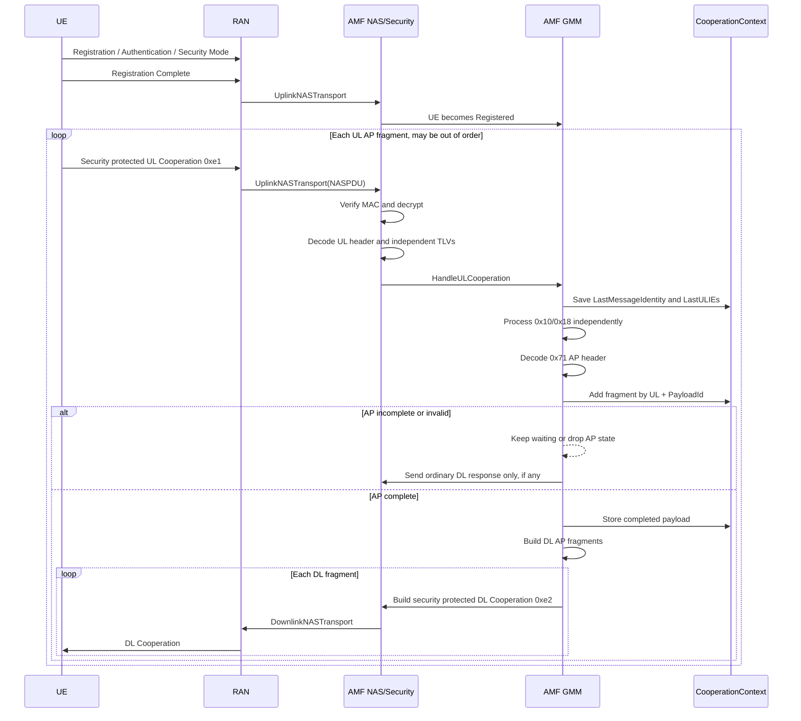

# UL/DL Cooperation 与 AP Container 移植指南

本文档说明如何把当前 AMF 分支中的 UL/DL Cooperation 和 AP Container 分片能力移植到另一个接近 free5GC 原版的 AMF。该能力是本地 NAS/GMM 扩展，不属于原版 free5GC 或 3GPP 标准消息。

## 1. 功能边界

新增两个 NAS 消息和一个 AP Container IE：

```text
UL Cooperation message type = 0xe1
DL Cooperation message type = 0xe2
AP Container IEI            = 0x71
```

当前流程由 UE 发起。UE 注册完成后发送受 NAS 安全保护的 UL Cooperation，AMF 解密、解析和处理各个 IE；需要响应时，AMF 通过 NGAP DownlinkNASTransport 返回一条或多条 DL Cooperation。

AMF 不会仅因为 UE 注册完成而主动发送 DL Cooperation。当前也没有新增 AP 层确认、重传或错误响应协议。

## 2. Cooperation 外层消息

UL/DL Cooperation 的固定头为 4 字节：

```text
Offset  Length  Field
0       1       EPD, 通常为 0x7e
1       1       SecurityHeaderType，plain body 中为 0x00
2       1       MessageType，UL=0xe1，DL=0xe2
3       1       MessageIdentity
4       ...     独立的可选 IE TLV 列表
```

同一条消息中的 IE 相互独立，可以同时出现。每条消息最多包含一个 `0x71`。

当前代码保留两种外层 IE length 编码：

```text
MessageIdentity == 0x01:
  IEI(1) + Length(1, uint8) + Value(Length)

MessageIdentity != 0x01:
  IEI(1) + Length(2, uint16, big-endian) + Value(Length)
```

这里的 legacy 只表示外层 length 仍可使用 2 字节。无论使用哪一种外层格式，`0x71` 的 Value 都必须是本文第 4 节定义的新 AP Container 格式。旧的 4-byte `ContainerContent` 内部格式不再兼容。

## 3. IEI 与处理行为

UL 支持的已知 IE：

```text
0x10  存入 NegotiatedIEs，并在 DL 中返回同值 0x10
0x18  存入 NegotiatedIEs，但不生成 DL 0x18
0x71  作为 AP Container 解码、重组、保存并重新生成 DL 分片
```

DL 只允许：

```text
0x10
0x71
```

未知 UL IE 会在 NAS 层保留，GMM 层记录日志后忽略。DL builder 遇到 `0x18`、未知 IE 或同一条 DL 中多个 `0x71` 时返回错误。

普通 IE 与 AP Container 的处理相互独立：

- AP 分片不完整、格式错误或重组失败，不会阻止同一条 UL 中的 `0x10/0x18` 生效。
- `0x10` 可以立即触发一条 DL，即使 `0x71` 还没有重组完成。
- `0x71` 不写入 `NegotiatedIEs`，完整载荷保存在专用的 completed AP Container 记录中。

## 4. AP Container 内部格式

### 4.1 字节布局

IE `0x71` 的 Value 使用固定 10 字节头：

```text
Offset  Length  Field
0       2       ContainerType, uint16
2       2       ContainerContentLength, uint16
4       1       ContainerTypePTI, uint8
5       2       ContainerPayloadId, uint16
7       1       ContainerFlags, uint8
8       2       FragmentOffset, uint16
10      N       Payload
```

所有多字节字段均为大端序。`FragmentOffset` 的单位是字节。

长度关系为：

```text
ContainerContentLength = 6 + len(Payload)
APContainerValueLength = 10 + len(Payload)
CooperationOuterLength = APContainerValueLength
```

编码器自动计算 `ContainerContentLength`。解码器要求 Value 至少 10 字节，并严格检查内部 length 与实际字节数相等。

### 4.2 ContainerPayloadId

`ContainerPayloadId` 是 2 字节无符号整数，用于标识一个完整载荷并关联其所有分片，`0x0000` 也是合法值。

重组键的作用域是：

```text
UE + Direction + ContainerPayloadId
```

不同 UE 或不同方向可以同时使用同一个 ID。同一 UE、同一方向中的未完成载荷不能复用 ID；完成、失败或超时清理后可以复用。

### 4.3 ContainerFlags

```text
Bit mask  Name  Meaning
0x02      DF    0=允许分片，1=禁止分片
0x04      MF    0=最后一片，1=后面还有分片
```

其余位为 reserved，接收端发现任一 reserved bit 非零时拒绝该 AP Container。

约束：

```text
DF=1 -> MF 必须为 0，FragmentOffset 必须为 0
DF=0 -> 既可以是分片，也可以是 offset=0、MF=0 的完整消息
空 Payload -> MF 必须为 0，FragmentOffset 必须为 0
```

### 4.4 FragmentOffset 与载荷上限

`FragmentOffset` 表示当前 Payload 在完整应用载荷中的起始字节位置：

```text
片 1: offset=0,   payload=245 bytes, MF=1
片 2: offset=245, payload=55 bytes,  MF=0
完整长度: 300 bytes
```

每片必须满足：

```text
FragmentOffset + len(Payload) <= 65535
```

完整重组载荷上限也是 65535 字节。

## 5. 具体编码示例

### 5.1 不分片 AP Container

字段值：

```text
ContainerType      = 0x0100
Payload            = aa bb
ContainerTypePTI   = 0x05
ContainerPayloadId = 0x1234
DF=1, MF=0
FragmentOffset     = 0
```

AP Container Value：

```text
01 00  00 08  05  12 34  02  00 00  aa bb
|type| |len | |PTI| | ID | |FL| |off| |data|
```

`ContainerContentLength=0x0008`，即固定内部字段 6 字节加 Payload 2 字节；整个 AP Value 长 12 字节，即 `0x0c`。

包含 `0x10/0x18/0x71` 的 UL plain NAS：

```text
7e 00 e1 01
10 01 01
18 01 01
71 0c 01 00 00 08 05 12 34 02 00 00 aa bb
```

对应 DL plain NAS：

```text
7e 00 e2 01
10 01 01
71 0c 01 00 00 08 05 12 34 02 00 00 aa bb
```

DL 不包含 `0x18`。

### 5.2 300 字节分片示例

`MessageIdentity=0x01` 的外层 length 只有 1 字节。AP 头占 10 字节，因此每个 DL 分片最多携带 245 字节 Payload，使 `0x71` Value 总长恰好 255。

首片头：

```text
71 ff
01 00       ContainerType
00 fb       ContainerContentLength = 6 + 245
05          PTI
12 34       PayloadId
04          DF=0, MF=1
00 00       Offset=0
<245 bytes payload>
```

末片头：

```text
71 41
01 00       ContainerType
00 3d       ContainerContentLength = 6 + 55
05          PTI
12 34       PayloadId
00          DF=0, MF=0
00 f5       Offset=245
<55 bytes payload>
```

UL 可以乱序发送，例如先发送 offset 245，再发送 offset 0。AMF 在只有末片时不生成 AP 响应；收到首片且区间 `[0,300)` 无空洞后完成重组。

DL 对完整载荷重新分片，不依赖 UL 分片的边界。第一条 DL 放普通响应 IE 和第一个 `0x71`，后续每条 DL 只放一个 `0x71`：

```text
DL #1: 7e 00 e2 01 10 01 01 71 ff <AP fragment offset 0>
DL #2: 7e 00 e2 01          71 41 <AP fragment offset 245>
```

### 5.3 2 字节外层 length

当 `MessageIdentity=0x02` 时，相同的新 AP Value 可以这样承载：

```text
7e 00 e1 02 71 00 0c 01 00 00 08 05 12 34 02 00 00 aa bb
```

`00 0c` 仅是外层 IE length。后面的 AP 内部结构仍是新格式，不接受旧 4-byte `ContainerContent`。

## 6. 完整信令流程



## 7. NAS 库改动

### 7.1 注册新消息

在 NAS message type、GMM message union 以及 plain encode/decode dispatcher 中增加 `0xe1/0xe2`：

```go
const (
    MsgTypeULCooperation uint8 = 0xe1
    MsgTypeDLCooperation uint8 = 0xe2
)
```

当前仓库使用本地 NAS fork：

```text
third_party/nas
```

### 7.2 CooperationIE

`CooperationIE` 只负责外层表示：

```go
type CooperationIE struct {
    Iei       uint8
    Len       uint8
    LegacyLen uint16
    Contents  []uint8
}
```

新外层格式要求 `len(Contents)<=255`；legacy 外层可到 65535。不要再在 `CooperationIE` 上保留旧 `GetContainerContent/SetContainerContent`，也不要在 GMM 中用固定下标手工读取 AP 字段。

### 7.3 AP Container codec

新增专用模型与 codec：

```go
type APContainer struct {
    ContainerType      uint16
    ContainerTypePTI   uint8
    ContainerPayloadID uint16
    ContainerFlags     uint8
    FragmentOffset     uint16
    Payload            []byte
}

func DecodeAPContainer(contents []byte) (*APContainer, error)
func (a *APContainer) Encode() ([]byte, error)
func (a *APContainer) DontFragment() bool
func (a *APContainer) MoreFragments() bool
```

codec 必须统一执行长度、reserved flags、DF/MF/offset、空载荷和 65535 上限检查，避免上层出现多套不一致的验证。

## 8. UE 状态与生命周期

在 `CooperationContext` 中增加专用 AP 状态：

```text
APContainerState
  Reassemblies: map[(Direction, PayloadId)]ReassemblyState
  Completed:    map[PayloadId]CompletedAPContainer
```

每个重组状态保存：

```text
ContainerType, PTI, DF
MessageIdentity, AccessType
Fragments[offset]
FinalLength
CreatedAt, Generation, Timer
```

同一载荷的所有片必须保持 `ContainerType`、PTI、DF、MessageIdentity 和 AccessType 一致。完整记录保存 type、PTI、payload ID、完整 Payload 和完成时间。

当前资源限制：

```text
每 UE、每方向最多 8 个未完成载荷
每个载荷最多 1024 个不同分片
每 UE 最多保留 8 个 completed 记录，超限淘汰最旧记录
每次重组绝对超时 30 秒，收到新片不刷新超时
```

UE 删除时必须停止所有 AP timer 并清空未完成状态。状态和返回给调用者的 Payload 都应做深拷贝，锁的粒度应限制在 AP 状态访问范围内。

## 9. UL 重组规则

推荐独立入口：

```go
func AddULAPContainerFragment(
    ue *context.AmfUe,
    accessType models.AccessType,
    messageIdentity uint8,
    fragment *nasMessage.APContainer,
    now time.Time,
) (*nasMessage.APContainer, error)
```

返回语义：

```text
nil, nil       合法但尚未完整
container,nil  重组完成
nil,error      失败，当前 payload 的重组状态已清理
```

重组器支持乱序和完全相同的重复片。任何非完全相同的重叠区间都属于歧义并导致该载荷失败。`MF=0` 的片确定最终长度，只有已收区间无间隙覆盖 `[0, finalLength)` 时才完成。

超时时记录 payload ID、已收片数和缺失区间；如果尚未收到末片，则缺失信息为 `final-length-unknown`。timer callback 使用 generation 校验，避免旧 timer 删除复用相同 payload ID 的新状态。

## 10. DL 再分片与消息分组

AMF 响应的是完整重组后的载荷，不直接 mirror 某个 UL 原始片：

```text
DF=0: 按最多 245 Payload bytes 生成 DL AP 分片
DF=1: 保持单条，不允许 AMF 分片
空 Payload: 生成 offset=0、MF=0 的单条 AP Container
```

对于 `MessageIdentity=0x01`，DF=1 且 AP Value 超过 255 字节时无法用一字节外层 length 编码，builder 返回错误并丢弃 AP 响应。对于 legacy 外层，Value 最大为 65535 字节。

`processULCooperationIEs` 返回多组 DL IE：

```text
group 0 = ordinary response IEs + AP fragment 0
group 1 = AP fragment 1
group 2 = AP fragment 2
...
```

每组分别构造成一条 DL Cooperation 并经 NGAP 下发。这保证每条消息最多一个 `0x71`。

## 11. GMM 接入点

在 GMM dispatcher 中增加：

```go
case nas.MsgTypeULCooperation:
    return HandleULCooperation(amfUe, accessType, gmmMessage.ULCooperation)
```

处理顺序：

1. 拒绝 MAC 校验失败或缺少 UE/RAN 上下文的消息。
2. 保存本条消息的 identity 和原始 `LastULIEs`。
3. 先按 handler registry 处理 `0x10/0x18`。
4. 要求本条消息最多一个 `0x71`。
5. 解码 AP，加入重组器；错误只丢弃 AP 路径。
6. 完成后保存 completed record，并生成 DL AP fragments。
7. 对每个 DL IE group 调用 `SendDLCooperation`。

普通 IE handler registry 便于以后扩展：

```go
var ulCooperationIEHandlers = map[uint8]cooperationIEHandler{
    0x10: handleULCooperationIE10,
    0x18: handleULCooperationIE18,
}
```

`0x71` 不建议作为普通 handler 注册，因为它需要跨消息状态和多条 DL 分组。

## 12. 安全与 NGAP 发送

Cooperation 一般发生在注册完成后，UL NAS 必须走现有安全链路：

```text
NGAP UplinkNASTransport
-> NAS integrity verification
-> NAS decryption
-> plain UL Cooperation decode
-> GMM dispatch
```

DL 使用现有 NAS security context 加密并计算 MAC，再调用 NGAP DownlinkNASTransport。连续生成多条 DL 时，每条消息使用递增的 DL NAS count；测试工具解密多条历史消息时必须使用各自编码时的 count，不能都使用当前 count 减一。

## 13. 日志与错误策略

AP 格式错误、metadata 不一致、重叠、资源超限、超时和 DL 编码失败均记录日志后丢弃，不发送新增协议错误响应。日志应包含：

```text
AccessType, MessageIdentity
ContainerType, PTI, PayloadId
DF, MF, FragmentOffset, PayloadLength
具体错误原因
```

为避免大载荷刷屏，Payload hex 日志最多输出前 32 字节，同时记录完整长度。

## 14. 测试要求

至少覆盖：

1. 10 字节 AP 头精确编码、解码和所有结构校验。
2. 新外层一字节 length 的 245 字节 Payload 边界。
3. legacy 外层承载新 AP 内部头。
4. 乱序、完全重复、重叠、metadata mismatch 和最终长度冲突。
5. 8 个并发重组、1024 片、30 秒 generation-safe timeout。
6. completed 深拷贝和最旧记录淘汰。
7. DF=0 DL 分片、DF=1 不分片、空 Payload。
8. 普通 IE 与 AP 失败/未完成相互独立。
9. DL builder 拒绝 `0x18` 和多个 `0x71`。
10. 注册完成后通过受保护 UL 注入乱序分片，并验证多条受保护 DL。
11. context、GMM 和 NGAP 相关 race tests。

相关文件：

```text
third_party/nas/nasMessage/NAS_APContainer_test.go
internal/context/ap_container_test.go
internal/gmm/ap_container_reassembly_test.go
internal/gmm/ap_container_downlink_test.go
internal/gmm/cooperation_test.go
internal/gmm/message/cooperation_test.go
internal/nas/ul_cooperation_test.go
internal/nas/dl_cooperation_test.go
internal/ngap/registration_procedure_test.go
```

验证命令：

```bash
cd third_party/nas
go test ./...

cd ../..
go test ./...
go test -race ./internal/context ./internal/gmm ./internal/gmm/message ./internal/ngap
```

NGAP 测试通过 `httptest` 监听本地端口，受限 sandbox 中可能需要开放 listen 权限。

## 15. 移植检查表

```text
[ ] 注册 NAS message type 0xe1/0xe2，并接入 plain encode/decode
[ ] 实现 ULCooperation、DLCooperation 和通用 CooperationIE
[ ] 保留需要的外层一字节/二字节 length 规则
[ ] 实现严格的 10 字节 AP Container codec
[ ] 删除旧 4-byte ContainerContent 的访问与兼容路径
[ ] 在 AmfUe 上增加有锁的 AP reassembly/completed 状态
[ ] UE 删除时停止 timer 并清理状态
[ ] 实现乱序、重复、重叠、末片和 gap 检查
[ ] 实现并发数、片数、载荷长度、completed 数和超时限制
[ ] 让 0x10/0x18 独立于 0x71 处理
[ ] completed AP 不写入 NegotiatedIEs[0x71]
[ ] 按 DF 和 245 字节规则生成 DL AP fragments
[ ] 每条 Cooperation 最多一个 0x71
[ ] 多个 DL fragments 分成多条 DL Cooperation 发送
[ ] 接入 NAS security 和 NGAP DownlinkNASTransport
[ ] 增加 codec、重组、GMM、NGAP 和 race tests
```

## 16. 常见问题

### 是否兼容旧 UE 的 4-byte ContainerContent？

不兼容。长度恰好大于等于 10 并不代表合法，内部 `ContainerContentLength`、flags 和 offset 都必须通过严格校验。

### 为什么还存在 legacy length？

它只保留 Cooperation IE 外层 `uint16` length 的承载能力，不代表恢复旧 AP 内部格式。两种外层格式都使用相同的新 10 字节 AP 头。

### 为什么 DL 不是原样返回 UL 分片？

UL 的分片边界和到达顺序不可信。AMF 先得到完整载荷并存储，再按自己的外层限制生成确定的 DL 分片。

### 没有真实 UE 怎么测试？

标准 UERANSIM 不会发送本地扩展 `0xe1`。当前最接近真实链路的无 UE 测试是 NGAP registration mock：完成注册和安全上下文后，通过 UplinkNASTransport 注入加密 UL Cooperation，并从 DownlinkNASTransport 解出 DL Cooperation。真实空口测试仍需修改 UE/UESIM 侧 NAS 实现。
