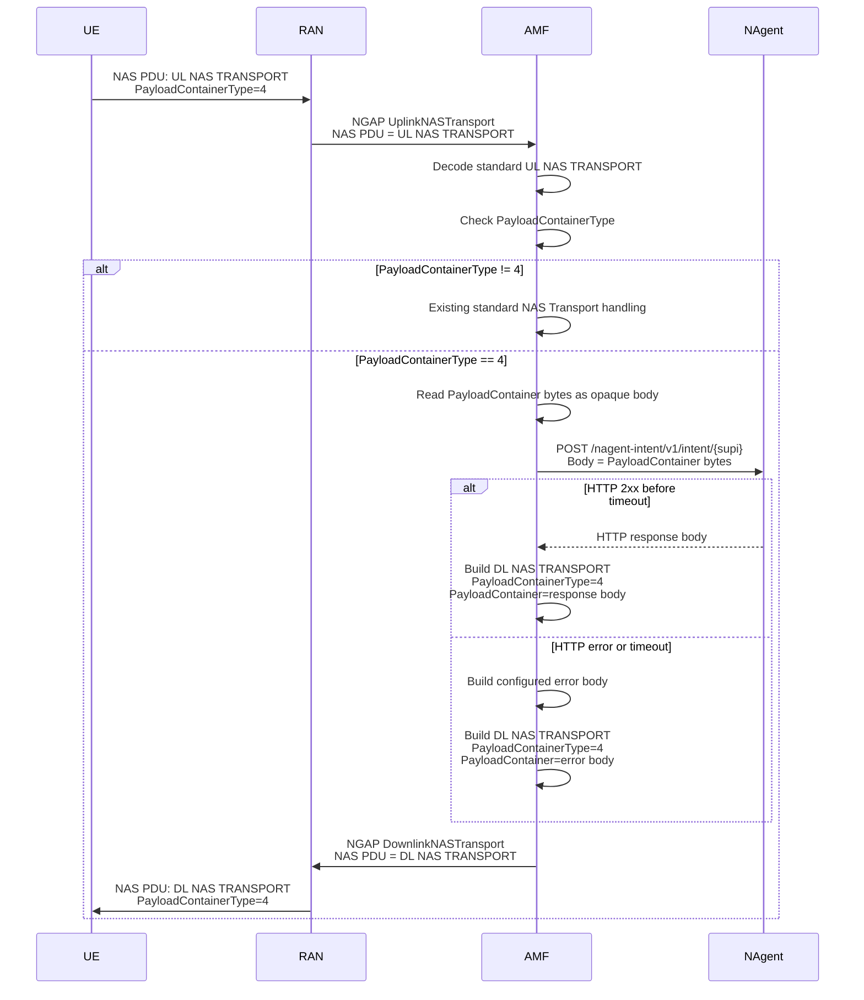
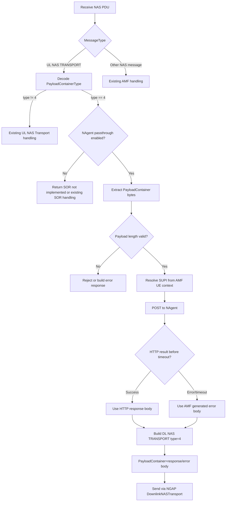
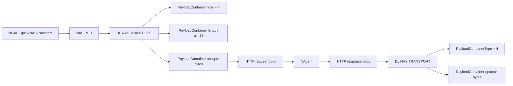

# NAS Transport Type 4 承载 NAgent Passthrough 设计草案

本文档用于 AMF 侧和 UE/NAS 代理侧对齐：在不新增自定义 NAS message type 的情况下，通过标准 `UL NAS TRANSPORT` / `DL NAS TRANSPORT` 外壳实现类似当前 Cooperation 的 NAgent HTTP 转发能力。

本文是设计草案，不代表当前 AMF 已经完整实现。当前 AMF 已经实现的 Cooperation 路径仍然是自定义 NAS 消息：

```text
UL Cooperation = 0xe1
DL Cooperation = 0xe2
```

新沟通后的方向是：

```text
UL NAS TRANSPORT:
  PayloadContainerType = 4
  PayloadContainer     = opaque bytes, directly forwarded to NAgent

DL NAS TRANSPORT:
  PayloadContainerType = 4
  PayloadContainer     = opaque bytes, copied from NAgent HTTP response body
```

也就是说，`PayloadContainer` 内部不再额外包一层 Cooperation envelope，不再解析 `MessageIdentity + TLV IE list`，也不再把 `AP Container` 放在 `PayloadContainer` 内部。AMF 只把 `PayloadContainer` 视为不透明载荷。

## 1. 设计目标

目标：

```text
UE -> AMF:
  使用标准 UL NAS TRANSPORT message type
  PayloadContainerType 固定为 4
  PayloadContainer 内容作为 HTTP request body 原样转发给 NAgent

AMF -> UE:
  等待 NAgent HTTP 响应或超时
  使用标准 DL NAS TRANSPORT message type
  PayloadContainerType 固定为 4
  PayloadContainer 内容填充为 HTTP response body 或 AMF 生成的错误 body
```

非目标：

```text
不改变 NGAP UplinkNASTransport / DownlinkNASTransport 过程
不要求 SMF/SMSF/LMF/PCF 处理该 payload
不在 NAS Transport payload 内定义 TLV
不在 NAS Transport payload 内定义 AP Container header
不由 AMF 解析 payload 内部 JSON 字段
不由 AMF 校验 intentId / intentType / intentDescription 等业务字段
```

核心思路：

```text
标准 NAS Transport 外壳
  + PayloadContainerType = 4
  + PayloadContainer opaque passthrough
  + NAgent HTTP request/response body passthrough
```

## 2. 和原 Cooperation 方案的关系

当前 Cooperation 路径中，UL/DL 自定义 NAS 消息内部可以携带多个独立 TLV IE，例如：

```text
IEI 0x10
IEI 0x18
IEI 0x71 = AP Container
```

其中 `0x71` 内部的 AP Container 又包含：

```text
ContainerType
ContainerLength
ContainerTypePTI
ContainerPayloadId
ContainerFlags
FragmentOffset
Payload
```

新的 NAS Transport Type 4 方案不复用这层结构。差异如下：

| 项目 | 当前 Cooperation | 新 NAS Transport Type 4 |
|---|---|---|
| NAS message type | 自定义 `0xe1/0xe2` | 标准 `0x67/0x68` |
| 触发条件 | MessageType 是 Cooperation | MessageType 是 NAS Transport 且 PayloadContainerType 是 `4` |
| 内部格式 | `MessageIdentity + TLV IE list` | 不透明 payload bytes |
| AP Container | `0x71` IE 内携带 | 不携带 |
| AMF 是否解析业务字段 | 不解析 AP payload | 不解析 payload |
| HTTP request body | 重组后的 AP payload | PayloadContainer 原始内容 |
| DL payload | AP Container 包裹 HTTP response | PayloadContainer 直接放 HTTP response body |

保留的相似点：

```text
1. 都由 UE 主动发送上行 NAS 消息触发。
2. AMF 都根据 UE 的 SUPI 调用 /nagent-intent/v1/intent/{supi}。
3. AMF 都等待 NAgent HTTP 响应或超时。
4. AMF 都把 NAgent response body 返回给 UE。
5. AMF 都不校验 payload 内部业务 JSON 结构。
```

## 3. PayloadContainerType=4 的含义

本仓库 NAS 库中已有常量：

```go
PayloadContainerTypeSOR = 0x04
```

也就是说，`PayloadContainerType=4` 在标准 NAS 语义里不是一个全新的私有值，而是已有的 SOR 类型。当前 AMF 的 `HandleULNASTransport` 对 SOR 分支尚未实现。

如果我们按本方案使用 `PayloadContainerType=4`，需要明确这是一个部署约定：

```text
当 NAgent passthrough 功能开启时:
  UL NAS TRANSPORT + PayloadContainerType=4 被 AMF 解释为 NAgent passthrough。

当 NAgent passthrough 功能关闭时:
  PayloadContainerType=4 可以继续按原 SOR 分支处理，或返回未实现。
```

风险：

```text
1. 该方案会复用标准 SOR 的 type 值。
2. 如果同一个 AMF 同时需要标准 SOR 和 NAgent passthrough，会产生语义冲突。
3. 需要通过配置开关、PLMN/切片隔离、专用测试 AMF 或 UE 能力开关避免误触发。
```

建议第一版：

```text
只在适配 UE/NAgent 的测试或专用环境开启该功能。
配置项中显式写出 payloadContainerType = 4。
日志中打印该分支为 NAgent passthrough，不再称为标准 SOR 处理。
```

## 4. 总体流程

### 4.1 端到端时序



### 4.2 AMF 内部处理流程



### 4.3 码流层次



## 5. NAS Transport 外层格式

### 5.1 UL NAS Transport

UE 发送：

```text
5GMM NAS message:
  ExtendedProtocolDiscriminator = 0x7e
  SecurityHeaderType            = depends on NAS security context
  MessageType                   = UL NAS TRANSPORT, 0x67
  PayloadContainerType          = 4
  PayloadContainerLength        = N
  PayloadContainer              = opaque payload bytes
```

去掉 NAS security 加密头后，plain NAS 结构可以理解为：

```text
Offset  Length  Field
0       1       ExtendedProtocolDiscriminator = 0x7e
1       1       SecurityHeaderType
2       1       MessageType = 0x67
3       1       SpareHalfOctetAndPayloadContainerType, low 4 bits = 4
4       2       PayloadContainerLength, uint16 big-endian
6       N       PayloadContainer bytes
```

AMF 收到后：

```text
if MessageType == UL NAS TRANSPORT and PayloadContainerType == 4:
  if feature enabled:
    body = PayloadContainer bytes
    POST body to NAgent
  else:
    keep existing SOR handling / not implemented behavior
else:
  keep existing standard NAS Transport handling
```

### 5.2 DL NAS Transport

AMF 返回：

```text
5GMM NAS message:
  ExtendedProtocolDiscriminator = 0x7e
  SecurityHeaderType            = depends on NAS security context
  MessageType                   = DL NAS TRANSPORT, 0x68
  PayloadContainerType          = 4
  PayloadContainerLength        = M
  PayloadContainer              = HTTP response body or AMF generated error body
```

plain NAS 结构：

```text
Offset  Length  Field
0       1       ExtendedProtocolDiscriminator = 0x7e
1       1       SecurityHeaderType
2       1       MessageType = 0x68
3       1       SpareHalfOctetAndPayloadContainerType, low 4 bits = 4
4       2       PayloadContainerLength, uint16 big-endian
6       M       PayloadContainer bytes
```

UE 收到后：

```text
if MessageType == DL NAS TRANSPORT and PayloadContainerType == 4:
  deliver PayloadContainer bytes to UE-side NAS proxy / application agent
else:
  process by existing UE NAS Transport logic
```

## 6. HTTP 转发行为

AMF 从 UE context 中获取 SUPI，并调用：

```text
POST /nagent-intent/v1/intent/{supi}
```

请求 body：

```text
PayloadContainer bytes from UL NAS TRANSPORT
```

响应处理：

```text
HTTP 2xx:
  DL PayloadContainer = HTTP response body

HTTP non-2xx:
  DL PayloadContainer = AMF generated error body

HTTP timeout:
  DL PayloadContainer = AMF generated timeout body
```

第一版建议超时时间：

```text
3 seconds
```

当前第一版实现复用已有 NAgent client，HTTP header 为：

```text
Content-Type: application/json
Accept: application/json
```

需要注意：这不表示 AMF 会解析 JSON。当前实现仍然把 `PayloadContainer` bytes 原样作为 HTTP body 发送给 NAgent。

后续如果真实 NAgent 希望严格使用二进制 header，可以再增加可配置 header：

```text
Content-Type: application/octet-stream
Accept: application/octet-stream
```

无论 header 如何设置，AMF 都不解析、不修改、不校验 body 内容。

错误 body 建议先使用简单 JSON，方便 UE 侧调试：

```json
{"error":"nagent_timeout"}
```

或：

```json
{"error":"nagent_http_error","status":502}
```

这些错误 body 是 AMF 自己生成的 payload，不影响正常成功路径的透传语义。

## 7. 并发与关联

该方案不在 NAS Transport payload 外额外定义 PTI，也不复用 AP Container 中的 `ContainerTypePTI`。

AMF 内部关联方式：

```text
每收到一条 UL NAS TRANSPORT type=4:
  启动一次同步 HTTP 请求
  当前处理上下文保存该 UL 请求对应的 UE/RAN/AccessType
  HTTP 返回后，直接给同一个 UE/RAN context 下发一条 DL NAS TRANSPORT type=4
```

也就是说，AMF 不需要从 HTTP response body 里解析 PTI 才能知道回给哪个 UE，因为这个关联由 AMF 的请求处理上下文持有。

但 UE 侧如果需要区分多个并发业务请求，需要在 `PayloadContainer` 业务内容内部自带应用层 ID，例如：

```json
{
  "intentId": "intent-001",
  "intentDescription": "..."
}
```

AMF 不理解这个字段，只负责透传。NAgent 应在 response body 中带回 UE 可识别的业务 ID。

需要 UE/NAgent 侧确认：

```text
1. UE 是否允许同时发送多个 type=4 UL NAS TRANSPORT？
2. UE 如何将多个 DL response 匹配回自己的请求？
3. 是否要求 NAgent response body echo intentId 或其他应用层 requestId？
```

## 8. 分片与长度限制

NAS Transport 的 `PayloadContainerLength` 是 2 字节字段，理论最大可以表达 65535 字节。

但实际路径仍受以下因素限制：

```text
UE NAS 实现的单条 NAS PDU 最大长度
RAN/NGAP/SCTP 路径缓冲限制
AMF NAS decoder buffer 限制
NAgent HTTP body 限制
```

第一版建议：

```text
UL PayloadContainer 最大长度: 1400 bytes
DL PayloadContainer 最大长度: 1400 bytes
HTTP response body 超过 1400 bytes 时返回错误，暂不做 NAS Transport 分片
```

如果未来需要大 payload，有两种扩展方向：

```text
方式 1:
  在 PayloadContainer 的业务内容内部定义应用层分片字段。
  AMF 仍然只透传，不参与重组。

方式 2:
  重新引入类似 AP Container 的 NAS 层分片结构。
  这会破坏当前 type=4 opaque passthrough 的简洁性。
```

当前建议采用方式 1：保持 AMF 透传，不让 AMF 理解 payload 内部分片。

## 9. 编码示例

### 9.1 UL NAS Transport 示例

假设 UE 要发送的 payload 是 ASCII：

```text
hello
```

payload hex：

```text
68 65 6c 6c 6f
```

去掉 NAS security 加密头后的 plain NAS 可以是：

```text
7e 00 67 04 00 05 68 65 6c 6c 6f
```

逐字段解析：

```text
7e
  ExtendedProtocolDiscriminator = 5GMM

00
  SecurityHeaderType = Plain NAS

67
  MessageType = UL NAS TRANSPORT

04
  SpareHalfOctetAndPayloadContainerType
  high 4 bits = 0
  low 4 bits  = 4
  PayloadContainerType = 4

00 05
  PayloadContainerLength = 5

68 65 6c 6c 6f
  PayloadContainer bytes
  AMF HTTP request body uses exactly these 5 bytes
```

AMF 发给 NAgent：

```http
POST /nagent-intent/v1/intent/imsi-208930000000003 HTTP/1.1
Content-Type: application/json
Accept: application/json

hello
```

### 9.2 DL NAS Transport 示例

假设 NAgent 返回 body：

```json
{"ok":true}
```

body hex：

```text
7b 22 6f 6b 22 3a 74 72 75 65 7d
```

AMF 下发的 plain NAS 可以是：

```text
7e 00 68 04 00 0b 7b 22 6f 6b 22 3a 74 72 75 65 7d
```

逐字段解析：

```text
7e
  ExtendedProtocolDiscriminator = 5GMM

00
  SecurityHeaderType = Plain NAS

68
  MessageType = DL NAS TRANSPORT

04
  PayloadContainerType = 4

00 0b
  PayloadContainerLength = 11

7b 22 6f 6b 22 3a 74 72 75 65 7d
  PayloadContainer bytes
  UE NAS proxy receives exactly these 11 bytes
```

### 9.3 JSON payload 示例

如果 UE 侧仍然希望传 intent JSON，AMF 不需要理解 JSON，只透传：

```json
{
  "intentId": "intent-001",
  "issuer": "ue",
  "intentPriority": 1,
  "intentType": "default",
  "intentDescription": "turn on the light",
  "object": "light",
  "constraint": "",
  "target": "room-1"
}
```

AMF 行为仍然是：

```text
UL PayloadContainer bytes = JSON bytes
HTTP request body         = same JSON bytes
HTTP response body        = arbitrary bytes returned by NAgent
DL PayloadContainer bytes = same response bytes
```

## 10. AMF 代码改造建议

第一阶段只实现 type=4 passthrough：

```text
1. 增加配置开关:
   nagent.transportPassthrough.enabled = true/false
   nagent.transportPassthrough.payloadContainerType = 4
   nagent.transportPassthrough.maxPayloadBytes = 1400
   timeout 复用 nagent.totalTimeoutMs，默认 3000ms

2. 在 HandleULNASTransport 中增加分支:
   if passthrough enabled and payloadContainerType == configured type:
     handleNAgentTransportPassthrough()
   else:
     keep existing NAS Transport handling

3. handleNAgentTransportPassthrough:
   body = ulNasTransport.PayloadContainer.GetPayloadContainerContents()
   responseBody = nagentClient.SubmitIntent(supi, body)
   build DL NAS TRANSPORT with PayloadContainerType=4

4. BuildDLNASTransport 直接复用现有 builder:
   payloadContainerType = 4
   nasPdu = responseBody

5. 测试:
   UL type=4 success
   UL type=4 timeout
   UL type=4 non-2xx
   type!=4 保持原逻辑
   feature disabled 时 type=4 不进入 NAgent
```

实际 YAML 示例：

```yaml
nagent:
  enabled: true
  baseUri: http://127.0.0.1:8088
  totalTimeoutMs: 3000
  transportPassthrough:
    enabled: true
    payloadContainerType: 4
    maxPayloadBytes: 1400
```

第二阶段按需要补充：

```text
1. HTTP header 可配置。
2. 最大 payload 长度可配置。
3. NAgent response 过大时的错误 body 格式。
4. 并发请求压力测试。
5. UE/NAgent 应用层 requestId 约定。
```

## 11. UE 侧需要确认的问题

仍需 UE/NAgent 侧确认：

```text
1. UE 是否确认用 PayloadContainerType=4 作为 NAgent passthrough 触发条件？
2. UE 是否会同时使用标准 SOR？如果会，type=4 会冲突。
3. UE 是否要求 AMF 对 payload 做 NAS 层分片？
4. UE 单条 UL NAS TRANSPORT payload container 最大可接受多大？
5. UE 单条 DL NAS TRANSPORT payload container 最大可接受多大？
6. UE 如何区分多个并发请求的响应？是否依赖 payload 内部 intentId/requestId？
7. NAgent HTTP header 要求是 application/octet-stream 还是 application/json？
8. NAgent response body 超过 AMF 限制时，UE 希望收到什么错误格式？
```

## 12. 推荐决策

第一版建议固定为：

```text
Transport trigger:
  MessageType = UL NAS TRANSPORT
  PayloadContainerType = 4

UL body:
  PayloadContainer bytes direct passthrough to NAgent HTTP body

HTTP:
  Method  = POST
  Path    = /nagent-intent/v1/intent/{supi}
  Timeout = 3s
  Body    = opaque bytes

DL body:
  HTTP response body direct passthrough as DL PayloadContainer

Payload parsing:
  AMF does not parse JSON
  AMF does not parse TLV
  AMF does not parse AP Container

Length:
  First version max 1400 bytes for UL and DL

Correlation:
  AMF correlates HTTP response with current UL handling context
  UE/NAgent correlate business requests using payload-internal ID if needed
```

## 13. 一句话结论

新方案是：

```text
UE -- UL NAS TRANSPORT(type=4, payload bytes) --> AMF
AMF -- POST /nagent-intent/v1/intent/{supi}, body=payload bytes --> NAgent
NAgent -- HTTP response body --> AMF
AMF -- DL NAS TRANSPORT(type=4, payload bytes=response body) --> UE
```

AMF 在该路径中只负责 NAS Transport 解包、HTTP 转发、等待响应和 DL NAS Transport 封包，不理解 payload 内部业务结构。
