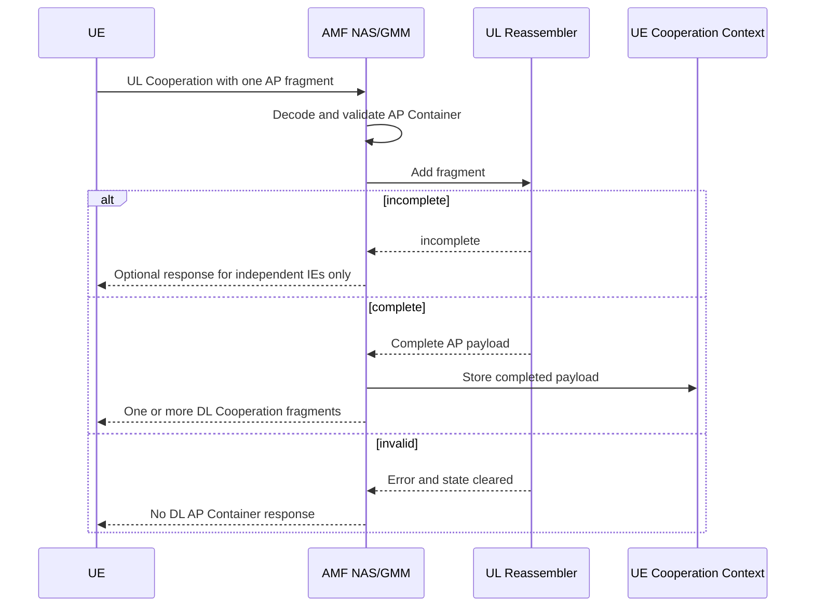

# AP Container Fragmentation Design

## 1. Purpose

This design replaces the old four-byte `ContainerContent` field in Cooperation IE `0x71` with explicit payload identification and fragmentation fields.

The AMF will:

- encode and decode the new AP Container structure;
- reject the old four-byte `ContainerContent` structure;
- reassemble UL AP Container fragments per UE;
- store completed AP Container payloads separately from ordinary Cooperation IEs;
- regenerate and, when allowed, fragment the complete payload for DL Cooperation;
- preserve the existing Cooperation outer-length formats.

This is a local NAS extension. It is not a standard free5GC or 3GPP message definition.

## 2. Scope

In scope:

- AP Container internal wire format;
- AP Container codec and validation;
- UL fragment reassembly;
- DL fragmentation;
- UE context storage;
- resource limits, timeout behavior, logging, and tests.

Out of scope:

- compatibility with the old four-byte `ContainerContent` format;
- retransmission or acknowledgement protocol additions;
- AP Container error/result messages;
- application-specific decoding of the final payload;
- fragmentation of Cooperation IEs other than `0x71`.

## 3. Existing Cooperation Envelope

AP Container remains IEI `0x71` inside the local Cooperation messages:

```text
UL Cooperation message type: 0xe1
DL Cooperation message type: 0xe2
AP Container IEI:            0x71
```

The existing outer-length selection remains unchanged:

```text
MessageIdentity == 0x01:
  IEI(1) + Length(1) + Contents(Length)

MessageIdentity != 0x01:
  IEI(1) + Length(2, big-endian) + Contents(Length)
```

Both outer formats carry only the new AP Container internal structure defined below.

Each UL or DL Cooperation message may contain at most one IEI `0x71`. Other independent optional IEs may appear in the same message.

## 4. AP Container Wire Format

### 4.1 Layout

The value of IEI `0x71` is encoded as follows:

```text
Offset  Length  Field
0       2       ContainerType
2       2       ContainerContentLength
4       1       ContainerTypePTI
5       2       ContainerPayloadId
7       1       ContainerFlags
8       2       FragmentOffset
10      N       Payload
```

All multi-byte integers use big-endian byte order.

```text
ContainerType          uint16
ContainerContentLength uint16
ContainerPayloadId     uint16
FragmentOffset         uint16
```

The fixed AP Container header length is 10 bytes.

### 4.2 Length Relationships

`ContainerContentLength` covers the fields after itself:

```text
ContainerContentLength
  = ContainerTypePTI(1)
  + ContainerPayloadId(2)
  + ContainerFlags(1)
  + FragmentOffset(2)
  + Payload(N)
  = 6 + N
```

The Cooperation IE outer length covers the complete AP Container value:

```text
OuterIELength = 10 + N
```

The codec computes `ContainerContentLength` during encoding. Callers do not set it independently.

During decoding, both relationships must match the actual byte slice.

### 4.3 Flags

```text
0x02: DF, Don't Fragment
  0: fragmentation is allowed
  1: fragmentation is prohibited

0x04: MF, More Fragments
  0: this is the last fragment
  1: more fragments follow
```

All other flag bits are reserved.

- A sender must set reserved bits to zero.
- A receiver rejects an AP Container with any reserved bit set.

### 4.4 Payload ID

`ContainerPayloadId` remains a two-byte unsigned integer. `0x0000` is a valid ID.

The uniqueness scope is:

```text
UE identity + direction + ContainerPayloadId
```

An ID cannot be reused while an incomplete reassembly with the same key exists. It may be reused after completion or timeout.

UL and DL directions have separate ID scopes. Different UEs may use the same ID concurrently.

### 4.5 Fragment Offset

`FragmentOffset` is a byte offset from the beginning of the complete application payload.

Example:

```text
Fragment 1: Offset=0,   PayloadLength=200, MF=1
Fragment 2: Offset=200, PayloadLength=200, MF=1
Fragment 3: Offset=400, PayloadLength=80,  MF=0
```

The complete reassembled payload length is limited to 65535 bytes:

```text
FragmentOffset + len(Payload) <= 65535
```

### 4.6 Empty Payload

The following empty payload is valid:

```text
PayloadLength=0, FragmentOffset=0, MF=0
```

The following are invalid:

```text
PayloadLength=0, MF=1
PayloadLength=0, FragmentOffset>0
```

### 4.7 DF Validation

For `DF=1`:

```text
MF must be 0
FragmentOffset must be 0
```

For `DF=0`, an unfragmented payload remains valid:

```text
MF=0, FragmentOffset=0
```

## 5. Component Design

### 5.1 CooperationIE

`CooperationIE` remains responsible only for the outer IE representation:

```text
IEI + outer Length + Contents
```

The existing one-byte and legacy two-byte outer-length codecs remain in place.

The old `GetContainerContent()` and `SetContainerContent()` accessors are removed. AP Container fields are no longer read by manually indexing `CooperationIE.Contents` outside the AP Container codec.

### 5.2 AP Container Codec

Add:

```text
third_party/nas/nasMessage/NAS_APContainer.go
```

Primary type:

```go
type APContainer struct {
    ContainerType      uint16
    ContainerTypePTI   uint8
    ContainerPayloadID uint16
    ContainerFlags     uint8
    FragmentOffset     uint16
    Payload            []byte
}
```

Primary API:

```go
func DecodeAPContainer(contents []byte) (*APContainer, error)
func (a *APContainer) Encode() ([]byte, error)
func (a *APContainer) DontFragment() bool
func (a *APContainer) MoreFragments() bool
```

Protocol constants include:

```go
APContainerHeaderLength      = 10
APContainerFlagDF            = 0x02
APContainerFlagMF            = 0x04
APContainerKnownFlags        = 0x06
APContainerMaxReassembledPayloadLength = 65535
APContainerMaxDLFragmentSize            = 245
```

The codec validates:

- minimum 10-byte value length;
- `ContainerContentLength >= 6`;
- content-length consistency;
- reserved flags;
- DF/MF/offset consistency;
- empty-fragment rules;
- fragment end offset not exceeding 65535.

### 5.3 UL Reassembler

Add:

```text
internal/gmm/ap_container_reassembly.go
```

The reassembler:

- accepts decoded and structurally valid AP Container fragments;
- tracks state by UE, UL direction, and payload ID;
- checks metadata consistency;
- supports out-of-order fragments;
- treats exact duplicate fragments as idempotent retransmissions;
- rejects ambiguous overlaps;
- determines the complete length from the `MF=0` fragment;
- completes only after `[0, totalLength)` has no gaps;
- enforces timeout and resource limits.

The intended handler-facing API is:

```go
func AddULAPContainerFragment(
    ue *context.AmfUe,
    accessType models.AccessType,
    messageIdentity uint8,
    fragment *nasMessage.APContainer,
    now time.Time,
) (*nasMessage.APContainer, error)
```

Return semantics:

```text
nil, nil:       valid but incomplete
container, nil: reassembly complete
nil, error:     reassembly failed and its state was removed
```

The completed container carries the original type, PTI, payload ID, DF value, and the complete payload. Its offset is zero and MF is zero.

### 5.4 Reassembly State

Each in-progress payload stores:

```text
Direction
ContainerPayloadId
ContainerType
ContainerTypePTI
DF
MessageIdentity
AccessType
fragments and byte intervals
known final length, if MF=0 has arrived
distinct fragment count
creation time
timer generation
absolute timeout timer
```

All fragments in one reassembly must have identical:

```text
ContainerType
ContainerTypePTI
ContainerPayloadId
DF
MessageIdentity
AccessType
```

Only MF, FragmentOffset, and Payload vary between fragments.

Fragments for one payload may not switch between 3GPP and non-3GPP access.

### 5.5 Completed Payload Storage

Do not store partial AP Container values in `NegotiatedIEs[0x71]`.

Storage responsibilities are:

```text
LastULIEs[0x71]:
  raw fragment Contents from the current UL Cooperation message

NegotiatedIEs:
  ordinary Cooperation IE values such as 0x10 and 0x18

CompletedAPContainers:
  structured, fully reassembled AP Container payloads
```

Completed record:

```go
type CompletedAPContainer struct {
    ContainerType      uint16
    ContainerTypePTI   uint8
    ContainerPayloadID uint16
    Payload            []byte
    CompletedAt        time.Time
}
```

Each UE retains at most eight completed records.

- Reusing and completing an existing payload ID replaces its old record.
- Adding a ninth distinct record evicts the oldest by `CompletedAt`.
- Removing the UE removes all completed records.

## 6. Reassembly Rules

### 6.1 Out-of-Order Delivery

Out-of-order fragments are accepted and indexed by byte offset.

### 6.2 Duplicate Delivery

A fragment is an exact duplicate when offset, payload length, payload bytes, and MF are identical. It is ignored as a retransmission and does not increase the distinct-fragment count.

### 6.3 Overlap

Any overlap that is not an exact duplicate is ambiguous. The AMF:

- rejects the fragment;
- clears the complete reassembly state for that payload ID;
- logs the conflicting ranges;
- sends no DL AP Container response.

### 6.4 Final Fragment

An `MF=0` fragment determines:

```text
totalLength = FragmentOffset + len(Payload)
```

If another final fragment declares a different total length, reassembly fails.

After total length is known:

- any fragment extending beyond it fails reassembly;
- completion requires complete coverage from byte zero to `totalLength`;
- adjacent fragments are valid and not considered overlapping.

### 6.5 Resource Limits

Per UE and direction:

```text
maximum concurrent incomplete payload IDs: 8
```

When a ninth new ID arrives, the AMF rejects the new ID without evicting existing reassemblies.

Per payload ID:

```text
maximum distinct fragments: 1024
```

Exceeding this limit fails and clears that payload reassembly.

### 6.6 Timeout

The reassembly timeout is an absolute 30 seconds from the first accepted fragment. Later fragments do not refresh it.

At timeout, the AMF:

- clears the incomplete state;
- logs the payload ID and missing ranges;
- sends no DL AP Container response.

Timer callbacks identify the state by UE, direction, payload ID, and generation. The generation prevents a stale timer from deleting a newer reassembly that reused the same ID.

UE removal cancels all AP Container reassembly timers.

## 7. UL Processing Flow

For each decrypted and integrity-verified UL Cooperation message:

1. Process ordinary optional IEs independently.
2. Reject the message's AP portion if more than one IEI `0x71` is present.
3. Decode IEI `0x71` Contents with `DecodeAPContainer`.
4. Pass a valid fragment, access type, and MessageIdentity to the UL reassembler.
5. If incomplete, retain state and generate no DL `0x71`.
6. If complete, save a completed record and remove the reassembly state.
7. Generate DL AP Container fragments from the complete payload.

An invalid or incomplete AP Container does not block handling of independent IE `0x10` or `0x18`.



## 8. DL Fragmentation and Sending

DL uses the reassembled complete payload and preserves:

```text
ContainerType
ContainerTypePTI
ContainerPayloadId
MessageIdentity
AccessType
DF semantics
```

### 8.1 DF Equals Zero

When fragmentation is allowed:

- split payload into chunks of at most 245 bytes;
- use DF=0 for all fragments;
- use MF=1 for every fragment except the final fragment;
- use MF=0 for the final fragment;
- use byte offsets based on actual preceding chunk lengths;
- send one AP Container fragment per DL Cooperation message.

An empty payload produces one fragment with offset zero and MF zero.

### 8.2 DF Equals One

When fragmentation is prohibited:

- send exactly one DL AP Container;
- set DF=1, MF=0, and offset zero;
- do not apply the 245-byte default fragment size.

The payload must fit the selected outer format:

```text
MessageIdentity == 0x01: maximum payload 245 bytes
MessageIdentity != 0x01: maximum payload 65525 bytes
```

If it does not fit, log an error and send no DL `0x71`. Do not violate DF by fragmenting.

### 8.3 Coexisting DL IEs

If the UL message that completes reassembly also produces ordinary DL IEs, place them only in the first DL Cooperation message:

```text
DL message 1: ordinary response IEs + AP fragment 1
DL message 2: AP fragment 2
DL message 3: AP fragment 3
```

If AP reassembly remains incomplete, ordinary DL IE responses may still be sent immediately without IEI `0x71`.

Every DL Cooperation message is independently NAS integrity protected and ciphered, then sent through `DownlinkNASTransport` on the recorded access type.

## 9. Error Handling

The first version adds no AP Container error response.

For malformed, conflicting, over-limit, or timed-out AP Container state:

- log the reason;
- discard the affected AP Container or reassembly;
- generate no DL `0x71`;
- continue processing independent Cooperation IEs.

Logs should include:

```text
UE identity or SUPI
AccessType
MessageIdentity
ContainerPayloadId
ContainerType
ContainerTypePTI
DF and MF
FragmentOffset
fragment payload length
current distinct fragment count
error reason or missing ranges
```

Do not log complete payload data. Debug logging may include a bounded hexadecimal prefix.

## 10. Concurrency and Lifecycle

Use a UE-level mutex to protect:

- incomplete reassembly maps;
- fragment state;
- timer generation and cancellation;
- completed AP Container records.

UL handlers, timer callbacks, and UE-removal cleanup must use the same lock.

Do not perform logging, NAS encoding, or NGAP sending while holding this lock. Copy the completed payload before releasing protected state.

## 11. Tests

### 11.1 Codec Tests

- encode and decode the new 10-byte header;
- verify big-endian fields;
- verify DF and MF helpers;
- reject values shorter than 10 bytes;
- reject content-length mismatches;
- reject reserved flag bits;
- reject DF/MF/offset conflicts;
- verify valid and invalid empty payloads;
- verify fragment end boundary at 65535;
- verify the old four-byte ContainerContent shape is not accepted as a complete new payload.

### 11.2 Reassembler Tests

- ordered reassembly;
- out-of-order reassembly;
- exact duplicate retransmission;
- conflicting overlap;
- adjacent non-overlapping fragments;
- conflicting final lengths;
- gaps after final length is known;
- metadata mismatch for type, PTI, DF, MessageIdentity, and AccessType;
- complete 65535-byte payload;
- eight concurrent reassemblies and rejection of the ninth;
- 1024 distinct fragments and rejection of the next;
- absolute 30-second timeout;
- payload ID reuse after completion and timeout;
- stale timer generation isolation;
- UE cleanup cancels timers.

### 11.3 GMM Tests

- incomplete AP reassembly produces no DL `0x71`;
- malformed AP does not block IE `0x10` or `0x18`;
- complete payload is stored only in `CompletedAPContainers`;
- completed-record replacement and oldest-entry eviction;
- DF=0 payload is split into 245-byte DL fragments;
- DL offsets and MF values are correct;
- DF=1 payload remains one DL message;
- DF=1 oversize for its outer format produces no DL `0x71`;
- ordinary DL IEs appear only in the first AP fragment message.

### 11.4 NGAP Integration Tests

- inject protected UL Cooperation fragments after registration;
- allow out-of-order fragment arrival;
- assert no DL AP message before completion;
- assert all DL fragments are separately security protected;
- decode DL fragments and verify complete payload reconstruction;
- verify sending through the access type recorded by the first fragment.

## 12. Acceptance Criteria

The implementation is complete when:

- all AP Container values use the new 10-byte internal header;
- old four-byte ContainerContent accessors and behavior are removed;
- valid ordered and out-of-order UL fragments reassemble correctly;
- invalid, overlapping, inconsistent, expired, or over-limit states are cleared safely;
- independent Cooperation IEs remain independent;
- complete payloads are retained in the bounded UE completed-record store;
- DL payloads follow the confirmed DF and 245-byte fragmentation rules;
- outer one-byte and two-byte Cooperation Length formats both remain supported;
- focused NAS, GMM, reassembly, and NGAP tests pass.
